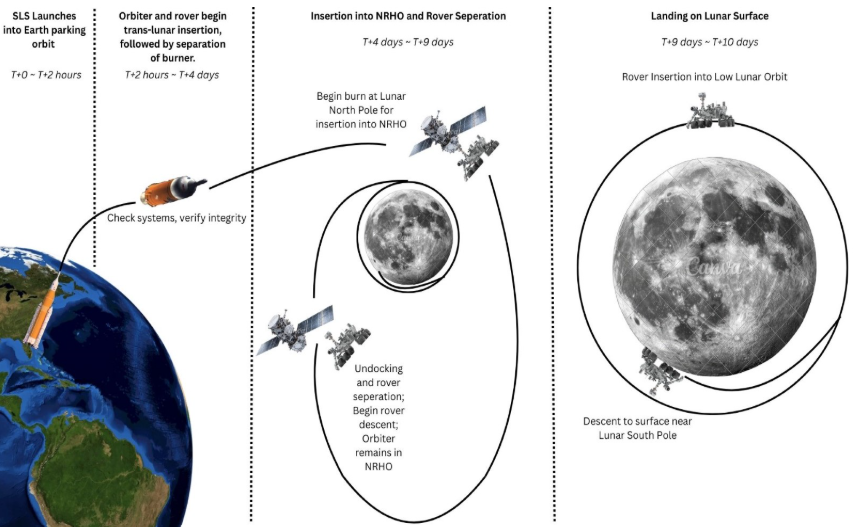

# 🌙 Lunar Rover Space Systems Design

**Course:** EAS 3530 – Space Systems Concepts, University of Central Florida
**Team:** Jaxon Borges & Dominick De La Torre
**Timeline:** Spring 2026

A two-part systems engineering study defining and designing an autonomous lunar rover mission — from mission concept and requirements down to power, thermal, C&DH, and telecommunications subsystem design.

---

## 🎯 Mission Concept

NASA TechPort identifies a technology gap in providing food, water, and supplies for long-duration crewed missions. This project proposes closing that gap with an autonomous rover that samples lunar regolith, mixes it with organic stimulants, and tests plant growth viability directly on the lunar surface.

**Minimum success criteria:**
- Land the rover without damage to the planting system
- Collect a lunar regolith sample
- Mix soil with stimulants and plant a seed

**Full success criteria** extend this to 5 sample sites across a 50 km radius and 5 seed varieties tested to maturity.

---

## 📋 Requirements & CONOPS

Requirements were decomposed across four levels — Mission, System, Subsystem, and Component — each with a defined verification method (Test, Demonstration, Analysis, Simulation, or Inspection).

*Add: the color-coded requirements tree diagram*

| Level | Example Requirement |
|---|---|
| Mission | Deploy an autonomous rover capable of lunar terrain traversal |
| System | Rover shall autonomously navigate unprepared terrain for up to 24 hours |
| Subsystem | Navigation system shall localize rover position within 1 m precision |
| Subsystem | Communication system shall transmit telemetry at ≥1 Mbps |

---

## 🛰️ Orbital Architecture

A **Near Rectilinear Halo Orbit (NRHO)** was selected for the communications relay satellite over Low Lunar Orbit and polar elliptical alternatives, chosen for long-duration visibility of the lunar south pole, low station-keeping requirements, and compatibility with NASA's Artemis architecture.

**Orbit parameters (via FreeFlyer):**
- Perilune: 1,600 km | Apolune: 69,500 km
- Semimajor axis: 35,550 km
- Period: 167.07 hours
- Perilune velocity: 2.448 km/s

*Add: ground track, orbit-from-Earth view, and Earth-Centered Inertial trajectory plots*

---

## 🔋 Power, Thermal & Mechanical

**Power budget:** 621 W peak draw across Survival, Moving, Sampling, and Plant Growing modes. Deployable solar arrays (3 × 0.5 m², ~450 W total) sized to keep the rover power-positive during the dominant plant-growth phase.

**Thermal:** Using solar constant (1370 W/m²), Earth IR (239 W/m²), and 0.25 albedo fraction, hot-case environmental input was calculated at 89 W and cold-case at 53.4 W — requiring ~34 W of supplemental heating during the 14-day lunar night.

**Mechanical layout:** Component placement was driven by two design decisions — keeping high-communication components (camera, navigation computer) physically close, and placing wheel motors inside the chassis to protect against lunar dust ingress.

*Add: the labeled rover CAD/sketch showing subsystem placement*

---

## 📡 Telecommunications Link Budget

The X-band (8.4 GHz) Earth–Moon link was closed through iterative antenna gain and data-rate trade studies:

| Iteration | Tx Gain | Rx Gain | Data Rate | Eb/No | Margin | Result |
|---|---|---|---|---|---|---|
| 1 (initial) | 25 dBi | 50 dBi | 1 Mbps | ~8 dB | −1.6 dB | Link does not close |
| 2 | 35 dBi | 50 dBi | 1 Mbps | ~18 dB | +8.4 dB | Works, low margin |
| 3 (final) | 35 dBi | 60 dBi | 500 kbps | 28.04 dB | **+18.4 dB** | Strong margin |

Ground stations at Cape Canaveral, the UK, and Guam provide >90% daily coverage through geographic separation.

---

## 🖥️ Command & Data Handling

Estimated raw data rate of 1.15 Mbps drove storage requirements of ~931.5 GB (with 25% margin) over the 60-day mission, recommending a 1 TB radiation-tolerant solid-state storage solution and a RAD750-class flight computer (200–400 MIPS).

*Add: the C&DH data flow diagram (sensors → OBC → storage → comms → orbiter → Earth)*

---

## 🧠 Key Systems Engineering Takeaways

- The most difficult budget to close was telecommunications, due to Earth–Moon signal loss, limited transmit power, and mass-constrained antenna size — resolved through a relay orbiter, higher-gain antenna, reduced data rate, and compression strategy.
- Strong subsystem interdependence meant payload sensor choices cascaded into C&DH processing/storage needs, which cascaded into telecom data-rate requirements, which cascaded into power budget.
- The 1 m/s traverse speed requirement was identified as a candidate for relaxation, since a science-focused, low-speed mission doesn't need high-speed mobility — trading complexity for reliability.

---

## 🛠️ Tools Used
`FreeFlyer` `Microsoft Excel` `Systems Engineering (Requirements/CONOPS)`

## 📁 Repo Contents
- `Project_1_Mission_Concept.pdf` — mission concept, requirements, orbital design
- `Project_2_Subsystem_Design.pdf` — power, thermal, C&DH, telecom subsystem design
- `images/` — diagrams and figures referenced above
